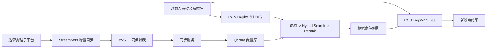

# 山西纪委信访案件智能检索系统 V1

山西纪委信访案件智能检索系统 V1，目标是在内网离线环境中，为办案人员提供“历史相似案件检索 + 重复件判断 + 新线索挖掘”能力。当前项目以后端服务为主，不包含前端页面。

## 1. 项目背景与需求摘要

办案人员在录入新信访件时，核心诉求是：

- 快速判断当前案件是否与历史案件重复
- 找出最相似的历史案件并给出理由
- 对比历史案件，识别当前新案件新增的可供延伸核查的新线索
- 整体方案可在内网单机环境部署运行

当前确认的生产数据链路为：

```text
达梦办理子平台 -> StreamSets -> MySQL -> 同步服务 -> Qdrant -> Identify API
```

其中：

- 达梦到 MySQL 的同步由上游 `StreamSets` 负责
- 本项目负责 `MySQL -> Qdrant -> 检索判断接口`
- 当前开发阶段先用 `mock` 模型服务替代真实 vLLM，优先打通全链路

## 2. 当前项目进度（截至 2026-04-17）

### 已完成

- FastAPI 后端骨架已搭建完成，包含统一配置、生命周期管理、异常处理、`request_id` 中间件
- 主接口已实现：
  - `POST /api/v1/identify`
  - `POST /api/v1/clues`
  - `POST /api/v1/admin/sync/full`
  - `POST /api/v1/admin/sync/rebuild-row`
  - `POST /api/v1/admin/sync/incremental`（当前版本固定返回 `501`，仅保留占位）
  - `GET /health`
  - `GET /ready`
  - `GET /ready/sync`
- 相似案件识别主链路已实现：
  - Phase 1：Qdrant 过滤
  - Phase 2：Hybrid Search（dense + sparse）+ RRF
  - Phase 3：Rerank
- 新线索挖掘接口已实现：
  - 客户端提交新案件与用户选中的 `similar_case`
  - LLM 输出结构化 `incremental_clues` 与 `supplemental_clues`
  - `incremental_clues` 表达当前新案件相对历史案件新增的延伸核查点
  - `supplemental_clues` 表达历史案件中已有、但当前新案件未明确提到、仍值得核查的补充线索
- MySQL -> Qdrant 同步已实现：
  - 已切换为读取标准源表 `case_similarity_source`
  - 应用内解密并映射到统一 `SourceCase`
  - 全量同步脚本 `scripts/full_sync.py`
  - 单条 HTTP 增量重建 `rebuild-row`
  - Qdrant 全量重建写入与单条 upsert
- 当前解密规则已在代码内落地：
  - 十六进制字符串 -> 字节数组 -> 每字节减 `1` -> `GBK` 解码
  - `encrypted_reported_persons` 优先按 JSON 解析，只提取 `mc`
- 当前识别召回规则已落地：
  - Qdrant 第一阶段过滤条件为：
    - 必须包含被举报人
    - `create_time` 在最近 `N` 年内
  - 被举报人重合奖励已移除，避免与硬过滤重复放大同一信号
- 本机联调环境已具备：
  - `mysql`
  - `qdrant`
  - `model-mock`
  - `fastapi`
- 固定样例测试数据与生产导出测试数据均已验证：
  - 测试表建表脚本
  - 31 条固定案件样例（24 条核心样例 + 7 条排序验证扩展样例）
  - 生产导出 `case_similarity_source.sql` 已完成导入、裁剪、全量同步验证
- 基础单元测试已提供并通过：
  - `python3 -m unittest discover -s tests -v`
  - 最近一次本地验证结果：`Ran 44 tests ... OK`
- 当前已完成的实际联调验证：
  - `case_similarity_source -> Qdrant` 全量同步已在真实测试数据上跑通
  - `rebuild-row` 单条增量重建已跑通
  - `identify` 已完成正样本命中验证
  - 已提供基于固定样例的排序系统化验证清单与评测脚本

### 已确认但尚未落地

- 真实 vLLM 模型服务接入与 GPU 部署
- 生产环境下的达梦字段映射和 `case_similarity_source` 契约细化
- `MySQL -> Qdrant` 的生产级全量重建方案（推荐使用新集合构建 + alias 切换）
- 增量同步的失败补偿、幂等和状态恢复
- 删除/失效语义与 Qdrant 删除策略
- 新线索挖掘的有效业务样本验收
- 更系统的准确率评测、性能压测和监控告警

### 当前结论

当前代码已经不是“规划稿”，而是一个可以继续联调和扩展的 V1 可运行后端骨架。现阶段更准确的定位是：

- 业务主链路已打通
- `case_similarity_source -> Qdrant -> identify` 已完成端到端验证
- `clues` 独立接口链路已完成本地测试
- 本机 Docker 联调可用
- 生产加固、真实模型效果验证和新线索业务验收仍在下一阶段

## 3. 需求范围与当前交付边界

### V1 范围内

- 后端识别服务
- MySQL 历史案件读取
- Qdrant 向量检索
- 重复件判断
- 新线索提取
- 本地 Docker 联调
- 固定样例测试数据

### V1 暂不包含

- 前端页面和管理台
- SSO / 权限体系
- 达梦侧同步改造
- 多机分布式部署
- 真实生产监控告警平台

## 4. 业务流程与系统架构

### 4.1 业务流程



### 4.2 识别链路

1. 用户提交新案件
2. 按被举报人和时间窗口构造过滤条件
3. 生成 query 的 dense / sparse 向量
4. 在 Qdrant 中执行 dense 与 sparse 双路召回
5. 用 RRF 融合得到候选集
6. 用 rerank 模型收敛候选顺序
7. 返回结构化相似案件结果
8. 如需新线索，再调用独立 `clues` 接口，对比用户选中的历史案件识别当前新案件新增信息

### 4.3 同步链路

1. 从 `case_similarity_source` 读取历史案件
2. 解密并标准化 `reported_persons` / `reporter` / `description_text`
3. 组装检索文本
4. 调用 embedding 服务生成向量
5. Upsert 到 Qdrant
6. 单条增量场景通过 `rebuild-row` 直接重建指定案件

## 5. 详细设计

### 5.1 API 设计

#### `POST /api/v1/identify`

请求体：

```json
{
  "reported_persons": ["王建国"],
  "reporter": "张三",
  "location": "太原市",
  "description": "反映王建国在城改项目中收受礼金并指定亲属承包附属工程",
  "time_range_years": 5
}
```

响应体：

```json
{
  "similar_cases": [
    {
      "case_id": "CASE-0001",
      "similarity_score": 91,
      "rank": 1,
      "location": "太原市",
      "reported_persons": ["王建国"],
      "reporter": "李四",
      "description_text": "历史案件提到王建国在城改项目中收受礼金并安排亲属承揽工程。"
    }
  ],
  "processing_time_ms": 1234,
  "request_id": "xxxx"
}
```

#### `POST /api/v1/clues`

请求体：

```json
{
  "reported_persons": ["王建国"],
  "reporter": "张三",
  "location": "太原市",
  "description": "反映王建国在城改项目中收受礼金并指定亲属承包附属工程",
  "time_range_years": 5,
  "similar_case": {
    "case_id": "CASE-0001",
    "similarity_score": 91,
    "rank": 1,
    "location": "太原市",
    "reported_persons": ["王建国"],
    "reporter": "李四",
    "description_text": "历史案件提到王建国通过亲属承揽附属工程。"
  }
}
```

响应体：

```json
{
  "incremental_clues": [
    {
      "source_case_id": "CASE-0001",
      "clue_type": "关系",
      "description": "当前新案件新增提到被举报人姐姐名下公司参与附属工程，相对历史案件 CASE-0001 可继续核查。",
      "risk_level": "高"
    }
  ],
  "supplemental_clues": [
    {
      "source_case_id": "CASE-0001",
      "clue_type": "金额",
      "description": "历史案件 CASE-0001 补充提到收受礼金金额，当前新案件未明确提到，可继续核查资金往来。",
      "risk_level": "高"
    }
  ],
  "processing_time_ms": 860,
  "request_id": "xxxx"
}
```

说明：

- `source_case_id` 表示本次新线索挖掘所参照的历史案件编号
- `incremental_clues` 表示当前新案件相对该历史案件新增、且值得继续核查的信息
- `supplemental_clues` 表示历史案件中已有、但当前新案件未明确提到、且值得继续核查的信息

#### `POST /api/v1/admin/sync/incremental`

- 当前版本固定返回 `501`
- 用于明确提示：当前增量入口为 `POST /api/v1/admin/sync/rebuild-row`
- 保留该接口主要是为了避免调用方误用旧路径

#### `POST /api/v1/admin/sync/full`

- 读取 `case_similarity_source`
- 按 `case_id ASC` 做 keyset 分页
- 重建 Qdrant 集合并执行全量写入

#### `POST /api/v1/admin/sync/rebuild-row`

- 接收单条 `case_similarity_source` 记录
- 直接在应用内完成解密、embedding、Qdrant upsert
- 当前是与 StreamSets 对接的主增量入口

#### 健康检查

- `GET /health`：进程存活
- `GET /ready`：识别依赖检查
- `GET /ready/sync`：同步依赖检查

### 5.2 核心模块设计

#### 应用层

- `app/main.py`
  - 应用入口
  - 中间件注入 `request_id`
  - 异常统一转换为标准错误响应
- `app/bootstrap.py`
  - 构建应用容器
  - 初始化各服务与引擎
  - 注入运行锁和同步锁

#### 识别链路

- `app/core/pipeline.py`
  - 串联识别与新线索两个主流程
- `app/core/filter.py`
  - 生成被举报人 + 时间过滤条件
- `app/core/hybrid_search.py`
  - 触发 dense / sparse 双路召回
  - 使用 RRF 融合排序
- `app/core/rerank.py`
  - 使用 rerank 服务重新排序候选集
- `app/core/llm_judge.py`
  - 输出“当前新案件相对历史案件新增”的新线索提取结果

#### 服务层

- `app/services/mysql_service.py`
  - 从 MySQL 读取 `case_similarity_source`
  - 提供全量批量读取和按 `case_id` 单条读取
- `app/services/qdrant_service.py`
  - 初始化集合
  - 创建 payload 索引
  - 执行 upsert
  - 提供 dense / sparse 查询
- `app/services/embedding_service.py`
  - 调用 OpenAI-compatible embedding 接口
- `app/services/rerank_service.py`
  - 调用 OpenAI-compatible rerank 接口
- `app/services/llm_service.py`
  - 调用 OpenAI-compatible chat 接口
  - 统一关闭思考模式

#### 同步层

- `app/sync/data_sync.py`
  - `full_sync` 读取 `case_similarity_source` 并重建 Qdrant
  - `rebuild_row` 处理单条 HTTP 增量重建
  - 在应用内完成解密、标准化、embedding、upsert

### 5.3 并发与运行约束

- `identify` 默认单并发
- `sync` 与 `identify` 互斥，避免争抢单卡资源
- 使用两个锁控制：
  - `runtime_lock`：识别链路独占
  - `sync_lock`：同步任务串行

### 5.4 Qdrant 设计

当前集合设计：

- 集合名：`xinfang_cases`
- dense 向量字段：`dense_vector`
- sparse 向量字段：`sparse_vector`
- dense 维度：`1024`

当前 payload 主要字段：

- `case_id`
- `location`
- `location_district`
- `reported_persons`
- `reporter`
- `create_time`
- `updated_at`
- `description_text`
- `status`
- `extra`

当前已创建 payload 索引：

- `location`
- `create_time`
- `updated_at`

### 5.5 MySQL 同步源表契约

当前应用已切换为读取标准源表：

- `case_similarity_source`

当前实际使用字段为：

- `case_id`
- `source_wtxx_bh`
- `petition_id`
- `location`
- `encrypted_reported_persons`
- `encrypted_reporter`
- `encrypted_description`
- `create_time`

当前约束与实现说明：

- `case_id` 是同步分页游标，也是 Qdrant 业务主键
- `encrypted_reported_persons` 当前要求为 UTF-8 JSON 字符串，应用内只提取 `mc`
- `encrypted_reporter` 与 `encrypted_description` 当前按十六进制字符串解密
- 当前不依赖 `updated_at/status` 字段

测试环境可直接执行 `scripts/create_test_schema.sql` 创建最小联调表结构。

### 5.6 生产同步设计（当前已确认）

当前已确认的生产思路如下：

- 达梦 -> MySQL 由 StreamSets 负责
- 本项目只认 MySQL，不直接读取达梦
- 当前应用侧已实现：
  - `POST /api/v1/admin/sync/full`
  - `POST /api/v1/admin/sync/rebuild-row`
- 推荐增量对接方式：
  - StreamSets 监听 `case_similarity_source`
  - 通过 HTTP 调用 `rebuild-row`
- 推荐全量重建场景：
  - 首次上线
  - 向量模型变化
  - 索引策略变化
  - 数据一致性异常
- 推荐全量重建策略：
  - 新建集合
  - 全量写入
  - 校验通过后 alias 切换

说明：

- 当前代码中的基础实现按 `case_id` 分批读取并执行全量重建
- 当前增量策略为“单条 HTTP 重建”，而不是轮询游标
- 后续如需批量增量或断点恢复，可在中间层补充 `sync_updated_at + case_id` 游标
- 生产级 alias 切换和对账机制仍待补充

### 5.7 加密字段处理设计（已确认方案）

当前已确认的设计决策：

- 达梦同步到 MySQL 后，部分字段仍可能保持密文
- 解密不放在上游 StreamSets，也不放在 Qdrant 或 LLM 服务层
- 最合适的落点是：`MySQL -> Qdrant` 同步进程的读取/标准化层
- 当前首版解密字段为：
  - `encrypted_reported_persons`
  - `encrypted_reporter`
  - `encrypted_description`
- 同步服务读取 `case_similarity_source` 后，先解密并标准化，再组装 `SourceCase`
- 当前默认允许 Qdrant 保存明文 payload，因此同步链路解密后可直接用于：
  - 向量生成
  - Qdrant payload
  - Rerank / LLM 判断

当前代码已提供 `DecryptProvider` 抽象，当前默认实现已支持以下规则：

- 普通十六进制字符串：
  - 去空格
  - 转字节数组
  - 每个字节减 `1`
  - 按 `GBK` 解码
- `encrypted_reported_persons`：
  - 先按 JSON 解析
  - 只提取 `mc`
  - `mc` 内容再按同样规则解密

说明：

- JSON 解析失败时，`reported_persons` 当前直接返回空列表，不再回退为逗号拆分
- 后续如接入真实解密组件，可替换 `DecryptProvider` 实现

## 6. Docker 联调与离线服务器部署

当前 `docker-compose.yml` 默认启动 2 个服务：

- `qdrant`
- `fastapi`

说明：

- 默认 compose 方案假设模型服务由宿主机提供
- 默认 compose 方案也支持直接连接外部 MySQL，不要求本机再起 `mysql` 容器
- `fastapi` 容器通过 `host.docker.internal` 访问宿主机上的真实 vLLM 服务
- 如需继续使用仓库内 `model-mock`，建议单独手工启动，不再作为默认 compose 依赖
- 如需本机自带 MySQL 联调，可显式启用 `local-mysql` profile

### 启动

```bash
docker compose up -d --build
```

如需同时启动仓库内本地 MySQL：

```bash
docker compose --profile local-mysql up -d --build
```

如宿主机 Docker 需要通过本地代理完成 `build/pull`，可在 `.env` 中补充 `DOCKER_BUILD_*` 变量，然后使用仓库内的代理覆盖文件：

```bash
docker compose -f docker-compose.yml -f docker-compose.proxy.yml up -d --build
```

说明：

- `docker-compose.proxy.yml` 只处理 `fastapi` 的 build 阶段代理
- 运行时 `NO_PROXY` 建议显式包含 `host.docker.internal,mysql,qdrant`，避免容器内部调用误走代理

### 离线服务器真实模型版配置

当宿主机已经启动真实 vLLM 服务时，`.env` 建议至少配置为：

```env
LLM_BASE_URL=http://host.docker.internal:9000/v1
EMBEDDING_BASE_URL=http://host.docker.internal:9001/v1
RERANK_BASE_URL=http://host.docker.internal:9002/v1

LLM_MODEL=qwen3.5-27b-awq
EMBEDDING_MODEL=bge-m3
RERANK_MODEL=bge-reranker-v2-m3

RUNTIME_NO_PROXY=localhost,127.0.0.1,host.docker.internal,mysql,qdrant

MYSQL_HOST=156.5.32.67
MYSQL_PORT=3306
```

推荐启动顺序：

1. 先确认宿主机三个 vLLM 服务已启动
2. 再执行 `docker compose up -d --build`
3. 确认 `156.5.32.67:3306` 可访问
4. 进入 `seed -> full_sync -> identify -> clues` 联调，验证当前新案件增量线索识别

宿主机检查：

```bash
curl http://127.0.0.1:9000/v1/models
curl http://127.0.0.1:9001/v1/models
curl http://127.0.0.1:9002/v1/models
nc -vz 156.5.32.67 3306
```

容器内检查：

```bash
docker compose exec fastapi sh
curl http://host.docker.internal:9000/v1/models
curl http://host.docker.internal:9001/v1/models
curl http://host.docker.internal:9002/v1/models
```

如果容器内访问失败，优先排查宿主机模型端口、`host.docker.internal` 映射和本机防火墙。

如果使用外部 MySQL，还需要确认：

- `MYSQL_HOST=156.5.32.67`
- 远端 MySQL 已放通 `3306`
- 该服务器允许当前应用服务器的来源 IP 访问
- `case_similarity_source` 表结构已经存在

### 查看状态

```bash
docker compose ps
docker compose logs -f fastapi
```

### 写入固定样例

```bash
docker compose exec fastapi python scripts/seed_test_cases.py --create-schema --truncate
```

### 执行全量同步

```bash
docker compose exec fastapi python scripts/full_sync.py
```

### 增量同步接口说明

`POST /api/v1/admin/sync/incremental` 当前固定返回 `501`，用于明确提示“当前增量入口已切换为 rebuild-row”。

当前实际增量入口为：

```bash
curl -X POST http://127.0.0.1:8000/api/v1/admin/sync/rebuild-row \
  -H 'Content-Type: application/json' \
  -d '{
    "case_id": "CASE-0001",
    "source_wtxx_bh": "CASE-0001",
    "petition_id": "CASE-0001",
    "location": "山西省 太原市",
    "encrypted_reported_persons": "{\"zj\":\"1\",\"mc\":\"c3bb b1b3\"}",
    "encrypted_reporter": null,
    "encrypted_description": "badd c1ee bced c3d3 cfcb cde3 a2a4",
    "create_time": "2024-01-01T00:00:00"
  }'
```

### 调用识别接口

```bash
curl -X POST http://127.0.0.1:8000/api/v1/identify \
  -H 'Content-Type: application/json' \
  -d '{
    "reported_persons": ["王建国"],
    "reporter": "测试举报人",
    "location": "太原市",
    "description": "反映王建国在城改项目中收受礼金并指定亲属承包附属工程",
    "time_range_years": 5
  }'
```

### 调用新线索接口

```bash
curl -X POST http://127.0.0.1:8000/api/v1/clues \
  -H 'Content-Type: application/json' \
  -d '{
    "reported_persons": ["王建国"],
    "reporter": "测试举报人",
    "location": "太原市",
    "description": "反映王建国在城改项目中收受礼金并指定亲属承包附属工程",
    "time_range_years": 5,
    "similar_case": {
      "case_id": "CASE-0001",
      "similarity_score": 91,
      "rank": 1,
      "location": "太原市",
      "reported_persons": ["王建国"],
      "reporter": "李四",
      "description_text": "历史案件提到王建国通过亲属承揽附属工程。"
    }
  }'
```

### 推荐离线服务器测试流程

1. 宿主机验证三路模型服务可访问
2. `docker compose up -d --build`
3. 确认外部 MySQL `156.5.32.67:3306` 可访问
4. 容器内验证 `host.docker.internal:9000/9001/9002` 可访问
5. 如需向外部 MySQL 写测试样例，再执行 `docker compose exec fastapi python scripts/seed_test_cases.py --create-schema --truncate`
6. `docker compose exec fastapi python scripts/full_sync.py`
7. 调用 `POST /api/v1/identify`
8. 如需验证新线索，再调用 `POST /api/v1/clues`
9. 检查：
   - `similar_case` 是否完整
   - `processing_time_ms` 是否合理
   - `incremental_clues` 与 `supplemental_clues` 是否能正常返回或为空但结构合法
   - `incremental_clues` 是否体现“当前新案件相对历史案件新增”的核查点
   - `supplemental_clues` 是否体现“历史案件补充提供、当前新案件未明确提到”的核查点

## 7. 测试与验收

### 当前已有测试资产

- 单元测试：
  - `tests/test_filter.py`
  - `tests/test_hybrid_search.py`
  - `tests/test_llm_judge.py`
  - `tests/test_llm_service.py`
  - `tests/test_pipeline.py`
  - `tests/test_ranking_eval.py`
  - `tests/test_sync_service.py`
  - `tests/test_sync_state.py`
- 固定样例说明：
  - `docs/test_case_manifest.md`
- 排序验证清单：
  - `docs/ranking_eval_manifest.json`
- 生产导出测试数据：
  - `docs/case_similarity_source.sql`

### 推荐验收流程

1. 启动 Docker 服务
2. 创建并写入 MySQL 固定样例
3. 执行全量同步
4. 执行排序系统化评测脚本
5. 如需验证端到端接口，先调用 `POST /api/v1/identify`
6. 如需验证新线索，再调用 `POST /api/v1/clues`
7. 对照 `docs/test_case_manifest.md` 与排序评测报告检查：
   - 是否命中预期重复件
   - 排序是否基本合理
   - 新线索接口是否返回结构合法结果
   - 同人不同事 / 同事不同人 / 同地不同部门 / 近义改写 / 简称别名场景是否符合 TopK 预期

### 本地单元测试命令

```bash
python3 -m unittest discover -s tests -v
```

### 排序系统化评测

评测目标：

- 只验证 `Hybrid Search + rerank`
- 不走 `LLM Judge`
- 当前默认“先测量不拦截”，即使有场景失败，脚本也会输出完整报告并返回 `0`

评测前准备：

```bash
python3 scripts/seed_test_cases.py --create-schema --truncate
python3 scripts/full_sync.py
```

运行评测：

```bash
python3 scripts/evaluate_ranking.py \
  --manifest docs/ranking_eval_manifest.json \
  --report-json data/app_state/ranking_eval_report.json
```

如需评测前自动执行一次全量同步，可加：

```bash
python3 scripts/evaluate_ranking.py \
  --manifest docs/ranking_eval_manifest.json \
  --run-full-sync \
  --report-json data/app_state/ranking_eval_report.json
```

如需只跑前几个场景做调试，可加：

```bash
python3 scripts/evaluate_ranking.py --limit 2
```

报告解读：

- `actual_top5`：实际 Top5 案件编号
- `failures`：未满足的规则，例如未命中 `expected_in_top3`、命中 `expected_not_in_top5`
- `category_summaries`：各场景分类的通过率
- `pass_rate`：总体通过率，当前仅用于测量，不作为硬门禁

### 当前已完成的联调验证

- `case_similarity_source -> Qdrant` 全量同步已在真实导出测试数据上跑通
- `rebuild-row` 单条增量重建已跑通
- 正样本 `identify` 命中验证已完成
- 已提供固定样例驱动的排序系统化评测脚本与清单
- 新线索独立接口链路已通，但尚未拿到稳定有效的业务样本结果
- 当前 `incremental_clues` 与 `supplemental_clues` 均支持返回参照历史案件编号 `source_case_id`

## 8. 目录结构

```text
discipline_case_similarity/
├── app/                    FastAPI 应用、核心逻辑、服务封装
├── docs/                   样例与联调说明
├── mock_model_server/      本地联调用 mock 模型服务
├── prompts/                LLM Prompt 模板
├── scripts/                初始化、全量同步、测试造数脚本
├── tests/                  单元测试
├── docker-compose.yml      本机 Docker 联调编排
├── Dockerfile              主应用镜像
├── .env.example            示例环境变量
├── README.md
└── 需求.md                 初始需求与架构设计草案
```

## 9. 本地开发

### 安装依赖

```bash
python3 -m venv .venv
source .venv/bin/activate
pip install -r requirements.txt
```

### 启动应用

```bash
uvicorn app.main:app --reload --host 0.0.0.0 --port 8000
```

### 常用脚本

```bash
python3 scripts/init_qdrant.py
python3 scripts/full_sync.py
python3 scripts/seed_test_cases.py --create-schema --truncate
python3 scripts/evaluate_ranking.py --manifest docs/ranking_eval_manifest.json
```

## 10. 下一阶段建议

建议下一阶段按这个顺序推进：

1. 接入真实 embedding / rerank / LLM 服务
2. 用真实样本验收“新线索挖掘”业务效果
3. 将 `rebuild-row` 增量链路补齐幂等、失败补偿和状态恢复
4. 增加全量重建别名切换与数据对账
5. 建立标注集，开展准确率和性能评测
