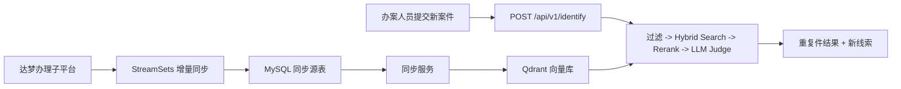

# 山西纪委信访案件智能检索系统 V1

山西纪委信访案件智能检索系统 V1，目标是在内网离线环境中，为办案人员提供“历史相似案件检索 + 重复件判断 + 新线索挖掘”能力。当前项目以后端服务为主，不包含前端页面。

## 1. 项目背景与需求摘要

办案人员在录入新信访件时，核心诉求是：

- 快速判断当前案件是否与历史案件重复
- 找出最相似的历史案件并给出理由
- 从历史案件中提取可供延伸核查的新线索
- 整体方案可在内网单机环境部署运行

当前确认的生产数据链路为：

```text
达梦办理子平台 -> StreamSets -> MySQL -> 同步服务 -> Qdrant -> Identify API
```

其中：

- 达梦到 MySQL 的同步由上游 `StreamSets` 负责
- 本项目负责 `MySQL -> Qdrant -> 检索判断接口`
- 当前开发阶段先用 `mock` 模型服务替代真实 vLLM，优先打通全链路

## 2. 当前项目进度（截至 2026-03-13）

### 已完成

- FastAPI 后端骨架已搭建完成，包含统一配置、生命周期管理、异常处理、`request_id` 中间件
- 主接口已实现：
  - `POST /api/v1/identify`
  - `POST /api/v1/admin/sync/incremental`（当前版本固定返回 `501`，仅保留占位）
  - `GET /health`
  - `GET /ready`
  - `GET /ready/sync`
- 四阶段识别主链路已实现：
  - Phase 1：Qdrant 过滤
  - Phase 2：Hybrid Search（dense + sparse）+ RRF
  - Phase 3：Rerank
  - Phase 4：LLM Judge + 新线索挖掘
- MySQL -> Qdrant 同步已实现：
  - `t_xf_wtxx` 与 `t_xf_xfj` 关联读取
  - 应用内解密并映射到统一 `SourceCase`
  - 全量同步脚本
  - Qdrant 全量重建写入
- 本机联调环境已具备：
  - `mysql`
  - `qdrant`
  - `model-mock`
  - `fastapi`
- 固定样例测试数据已提供：
  - 测试表建表脚本
  - 24 条固定案件样例
  - 验收说明文档
- 基础单元测试已提供并通过：
  - `python3 -m unittest discover -s tests -v`
  - 最近一次本地验证结果：`Ran 5 tests ... OK`

### 已确认但尚未落地

- 真实 vLLM 模型服务接入与 GPU 部署
- 生产环境下的达梦字段映射和 MySQL 同步源契约细化
- `MySQL -> Qdrant` 的生产级全量重建方案（推荐使用新集合构建 + alias 切换）
- 解密 provider 与真实解密能力的对接
- 增量同步、失败补偿和状态恢复
- 更系统的准确率评测、性能压测和监控告警

### 当前结论

当前代码已经不是“规划稿”，而是一个可以继续联调和扩展的 V1 可运行后端骨架。现阶段更准确的定位是：

- 业务主链路已打通
- 本机 Docker 联调可用
- 生产加固和真实模型效果验证仍在下一阶段

## 3. 需求范围与当前交付边界

### V1 范围内

- 后端识别服务
- MySQL 历史案件读取
- Qdrant 向量检索
- 重复件判断
- 新线索提取
- 本地 Docker 联调
- 固定样例测试数据

### V1 暂不包含

- 前端页面和管理台
- SSO / 权限体系
- 达梦侧同步改造
- 多机分布式部署
- 真实生产监控告警平台

## 4. 业务流程与系统架构

### 4.1 业务流程



### 4.2 识别链路

1. 用户提交新案件
2. 按属地和时间窗口构造过滤条件
3. 生成 query 的 dense / sparse 向量
4. 在 Qdrant 中执行 dense 与 sparse 双路召回
5. 用 RRF 融合得到候选集
6. 用 rerank 模型收敛候选顺序
7. 用 LLM 输出重复件判断与新线索
8. 返回结构化结果

### 4.3 同步链路

1. 从 MySQL 同步源表读取历史案件
2. 组装检索文本
3. 调用 embedding 服务批量生成向量
4. Upsert 到 Qdrant
5. 保存增量同步水位

## 5. 详细设计

### 5.1 API 设计

#### `POST /api/v1/identify`

请求体：

```json
{
  "reported_persons": ["王建国"],
  "reporter": "张三",
  "location": "太原市",
  "description": "反映王建国在城改项目中收受礼金并指定亲属承包附属工程",
  "time_range_years": 5
}
```

响应体：

```json
{
  "is_duplicate": true,
  "similar_cases": [
    {
      "case_id": "CASE-0001",
      "similarity_score": 91,
      "rank": 1,
      "reason": "被举报人重合，属地一致，案情词项相似度较高。"
    }
  ],
  "new_clues": [
    {
      "clue_type": "行为",
      "description": "历史案件 CASE-0003 提到“承揽”相关情节，可作为延伸核查线索。",
      "risk_level": "高"
    }
  ],
  "processing_time_ms": 1234,
  "request_id": "xxxx"
}
```

#### `POST /api/v1/admin/sync/incremental`

- 当前版本固定返回 `501`
- 用于明确提示：首版仅支持 `full_sync`
- 后续如恢复增量能力，再补充互斥与游标策略

#### 健康检查

- `GET /health`：进程存活
- `GET /ready`：识别依赖检查
- `GET /ready/sync`：同步依赖检查

### 5.2 核心模块设计

#### 应用层

- `app/main.py`
  - 应用入口
  - 中间件注入 `request_id`
  - 异常统一转换为标准错误响应
- `app/bootstrap.py`
  - 构建应用容器
  - 初始化各服务与引擎
  - 注入运行锁和同步锁

#### 识别链路

- `app/core/pipeline.py`
  - 串联整个四阶段流程
- `app/core/filter.py`
  - 生成属地 + 时间过滤条件
- `app/core/hybrid_search.py`
  - 触发 dense / sparse 双路召回
  - 使用 RRF 融合排序
- `app/core/rerank.py`
  - 使用 rerank 服务重新排序候选集
- `app/core/llm_judge.py`
  - 输出重复件判断
  - 输出新线索提取结果

#### 服务层

- `app/services/mysql_service.py`
  - 从 MySQL 读取同步源表
  - 解析 JSON 字段
  - 产出统一 `SourceCase`
- `app/services/qdrant_service.py`
  - 初始化集合
  - 创建 payload 索引
  - 执行 upsert
  - 提供 dense / sparse 查询
- `app/services/embedding_service.py`
  - 调用 OpenAI-compatible embedding 接口
- `app/services/rerank_service.py`
  - 调用 OpenAI-compatible rerank 接口
- `app/services/llm_service.py`
  - 调用 OpenAI-compatible chat 接口

#### 同步层

- `app/sync/data_sync.py`
  - 全量同步与增量同步共用同一套批处理逻辑
  - 从 MySQL 拉取数据
  - 调用 embedding
  - Upsert 到 Qdrant
  - 更新同步水位

### 5.3 并发与运行约束

- `identify` 默认单并发
- `sync` 与 `identify` 互斥，避免争抢单卡资源
- 使用两个锁控制：
  - `runtime_lock`：识别链路独占
  - `sync_lock`：同步任务串行

### 5.4 Qdrant 设计

当前集合设计：

- 集合名：`xinfang_cases`
- dense 向量字段：`dense_vector`
- sparse 向量字段：`sparse_vector`
- dense 维度：`1024`

当前 payload 主要字段：

- `case_id`
- `location`
- `location_district`
- `reported_persons`
- `reporter`
- `create_time`
- `updated_at`
- `description_text`
- `status`
- `extra`

当前已创建 payload 索引：

- `location`
- `create_time`
- `updated_at`

### 5.5 MySQL 同步源表契约

当前全量同步直接读取两张业务表：

- `t_xf_wtxx`
- `t_xf_xfj`

关联条件固定为：

- `t_xf_wtxx.C_XFJ_BH = t_xf_xfj.C_BH`

当前首版只使用以下字段：

- `w.C_BH` 作为 `case_id`
- `w.C_XFJ_BH` 作为 `source_xfj_bh`
- `w.LC_YJMS` 作为待解密的 `description_text`
- `w.DT_CJSJ` 作为 `create_time`
- `w.DT_ZHXGSJ`
- `x.C_BH` 作为 `petition_id`
- `x.C_BFYR_XX` 作为待解密的 `reported_persons`
- `x.C_FYR_XX` 作为待解密的 `reporter`
- `x.C_WTSD_QC` 作为 `location`
- `x.DT_CJSJ`
- `x.DT_ZHXGSJ`

测试环境可直接执行 `scripts/create_test_schema.sql` 创建最小联调表结构。

### 5.6 生产同步设计（当前已确认）

当前已确认的生产思路如下：

- 达梦 -> MySQL 由 StreamSets 负责
- 本项目只认 MySQL，不直接读取达梦
- 当前首版只实现全量重建，不实现增量轮询
- 推荐全量重建场景：
  - 首次上线
  - 向量模型变化
  - 索引策略变化
  - 数据一致性异常
- 推荐全量重建策略：
  - 新建集合
  - 全量写入
  - 校验通过后 alias 切换

说明：

- 当前代码中的基础实现按 `w.C_BH` 分批读取并执行全量重建
- 后续如需增量，可在中间层补充 `sync_updated_at + case_id` 游标
- 生产级 alias 切换和对账机制仍待补充

### 5.7 加密字段处理设计（已确认方案）

当前已确认的设计决策：

- 达梦同步到 MySQL 后，部分字段仍可能保持密文
- 解密不放在上游 StreamSets，也不放在 Qdrant 或 LLM 服务层
- 最合适的落点是：`MySQL -> Qdrant` 同步进程的读取/标准化层
- 当前首版解密字段为：
  - `x.C_BFYR_XX`
  - `x.C_FYR_XX`
  - `w.LC_YJMS`
- 同步服务读取 join 结果后，先解密并标准化，再组装 `SourceCase`
- 当前默认允许 Qdrant 保存明文 payload，因此同步链路解密后可直接用于：
  - 向量生成
  - Qdrant payload
  - Rerank / LLM 判断

当前代码已提供 `DecryptProvider` 抽象，默认使用 `noop/passthrough` 适配器；真实解密能力后续接入该抽象即可。

## 6. 本机 Docker 联调

当前 `docker-compose.yml` 默认启动 4 个服务：

- `mysql`
- `qdrant`
- `model-mock`
- `fastapi`

### 启动

```bash
docker compose up -d --build
```

### 查看状态

```bash
docker compose ps
docker compose logs -f fastapi
```

### 写入固定样例

```bash
docker compose exec fastapi python scripts/seed_test_cases.py --truncate
```

### 执行全量同步

```bash
docker compose exec fastapi python scripts/full_sync.py
```

### 增量同步接口说明

`POST /api/v1/admin/sync/incremental` 当前固定返回 `501`，用于明确提示“首版仅支持 full sync”。

### 调用识别接口

```bash
curl -X POST http://127.0.0.1:8000/api/v1/identify \
  -H 'Content-Type: application/json' \
  -d '{
    "reported_persons": ["王建国"],
    "reporter": "测试举报人",
    "location": "太原市",
    "description": "反映王建国在城改项目中收受礼金并指定亲属承包附属工程",
    "time_range_years": 5
  }'
```

## 7. 测试与验收

### 当前已有测试资产

- 单元测试：
  - `tests/test_filter.py`
  - `tests/test_hybrid_search.py`
  - `tests/test_llm_judge.py`
  - `tests/test_sync_state.py`
- 固定样例说明：
  - `docs/test_case_manifest.md`

### 推荐验收流程

1. 启动 Docker 服务
2. 创建并写入 MySQL 固定样例
3. 执行全量同步
4. 调用 `POST /api/v1/identify`
5. 对照 `docs/test_case_manifest.md` 检查：
   - 是否命中预期重复件
   - 排序是否基本合理
   - 是否返回新线索

### 本地单元测试命令

```bash
python3 -m unittest discover -s tests -v
```

## 8. 目录结构

```text
discipline_case_similarity/
├── app/                    FastAPI 应用、核心逻辑、服务封装
├── docs/                   样例与联调说明
├── mock_model_server/      本地联调用 mock 模型服务
├── prompts/                LLM Prompt 模板
├── scripts/                初始化、全量同步、测试造数脚本
├── tests/                  单元测试
├── docker-compose.yml      本机 Docker 联调编排
├── Dockerfile              主应用镜像
├── .env.example            示例环境变量
├── README.md
└── 需求.md                 初始需求与架构设计草案
```

## 9. 本地开发

### 安装依赖

```bash
python3 -m venv .venv
source .venv/bin/activate
pip install -r requirements.txt
```

### 启动应用

```bash
uvicorn app.main:app --reload --host 0.0.0.0 --port 8000
```

### 常用脚本

```bash
python3 scripts/init_qdrant.py
python3 scripts/full_sync.py
python3 scripts/seed_test_cases.py --create-schema --truncate
```

## 10. 下一阶段建议

建议下一阶段按这个顺序推进：

1. 接入真实 embedding / rerank / LLM 服务
2. 在同步链路接入加密字段解密
3. 将 MySQL 增量游标升级为生产可运维方案
4. 增加全量重建别名切换与数据对账
5. 建立标注集，开展准确率和性能评测
